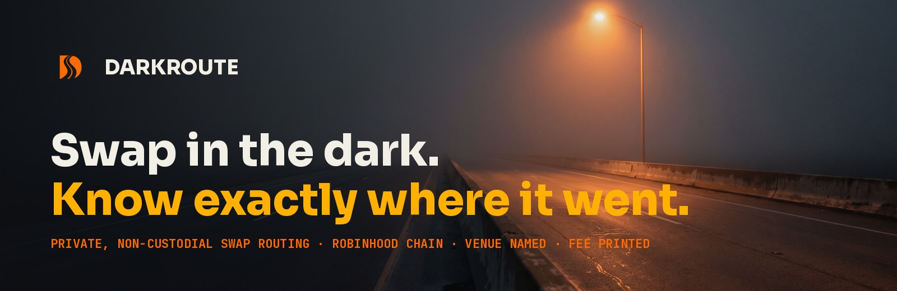

 

[**Launch app**](https://app.darkroute.exchange) · [Website](https://darkroute.exchange) · [Docs](https://darkroute.exchange/docs) · [Android](https://darkroute.exchange/android) · [Chrome extension](https://darkroute.exchange/extension) · [X](https://x.com/DarkrouteRH)

---

## What this is

DarkRoute is a private, non-custodial swap router on **Robinhood Chain** (chain ID 4663). You pick what to send and what to receive, paste a receiving address, and the order is routed through liquidity that never touches a public book. The receipt then tells you everything the market was not allowed to see: the venue that filled it, by its real name; the fee, as a number, printed before you deposited; the hash.

No account. No KYC. No custody at any point in the route.

**Privacy pointed at the market. Transparency pointed at you.**

---

## Live today

| | |
|---|---|
| **Router** | [app.darkroute.exchange](https://app.darkroute.exchange). Live quotes across 188 assets on 35 chains through one venue, NEAR Intents, named as-is on every quote. Real one-time deposit addresses, status tracking, shareable receipts. |
| **Fee** | 0.3% per swap, printed on the quote. DarkRoute nets 0.15%; the routing protocol keeps the other half. Holder tier discounts (5% to 50%) apply on the quote for signed-in wallets. |
| **Numbers** | Orders, settled volume and gross fee are on the [homepage](https://darkroute.exchange/#numbers), read from the router by your browser. They are small; they are real. |
| **Chrome extension** | The swap card in your toolbar. One host permission, no telemetry, no build step. [Source and zip](https://github.com/darkrouteRH/extension), or [darkroute.exchange/extension](https://darkroute.exchange/extension). Web Store listing: in review. |
| **Android** | A signed shell around the app. One permission, no keys held. [Releases](https://github.com/darkrouteRH/android) with sha256 and certificate fingerprint, or [darkroute.exchange/android](https://darkroute.exchange/android). Play Store: not yet. |

## Not live, and labelled that way on the site

Multi-venue route table, fee vault and ledger, cashback settlement in tokenized stocks, staking escrow, order shielding (Dark Split), the agent desk, public API, limit and DCA. Each is designed and documented; none is claimed as live anywhere. The day one ships it gets posted with a transaction hash.

---

## $DARK

Launched **8 September 2026** on the pons v2 launchpad on Robinhood Chain. Fair launch: no team allocation, no presale, no unlock schedule.

| | |
|---|---|
| Contract | `0xebb4c5b97e4117e30ec82ce025e6f21dded05436` |
| Explorer | [robinhoodchain.blockscout.com](https://robinhoodchain.blockscout.com/token/0xebb4c5b97e4117e30ec82ce025e6f21dded05436) |
| Supply | 1,000,000,000 minted. No `mint()`, no `owner()`, no `pause()` in the deployed bytecode; `burn()` present. Checkable by anyone. |
| Utility | Fee tiers (5% to 50% off), cashback multiplier, order slots, API keys, desk mirroring. It never changes the route, the venue or the price. |

**The only real address is the one printed on [darkroute.exchange](https://darkroute.exchange) and posted by [@DarkrouteRH](https://x.com/DarkrouteRH).** Anything pasted in a reply is a fake route.

---

## Repositories

| Repo | What |
|---|---|
| [extension](https://github.com/darkrouteRH/extension) | Chrome extension, MV3, plain JavaScript, tests included. MIT. |
| [android](https://github.com/darkrouteRH/android) | Signed Android builds under Releases, with hashes. |
| [contracts](https://github.com/darkrouteRH/contracts) | `DarkStaking` (commitment escrow) and `DarkBurner` (burn ledger). Written and tested, not deployed, not audited. |
| [address-rules](https://github.com/darkrouteRH/address-rules) | Per-chain address validation, zero dependencies, 24 chains. Extracted from the router. |

---

## What "private" means here

**Hidden from the market:** your order never touches a public order book or appears in the mempool as a visible swap, and no account links your swaps together.

**Not hidden, and we say so:** the venue filling your order sees the deposit and the receiving address; on-chain settlement is public; we keep an order record for support and rewards, with no names, no emails, no KYC.

Overclaiming privacy is how this category loses trust. The docs print the limits.

---

## Stack

Next.js · TypeScript · Tailwind · Postgres with forced row-level security · Docker behind Traefik. Containers run non-root, secrets never reach the browser bundle, every write endpoint fails closed.

---

**[darkroute.exchange](https://darkroute.exchange)** · **[app.darkroute.exchange](https://app.darkroute.exchange)** · [X](https://x.com/DarkrouteRH)

DarkRoute is a non-custodial routing interface. It does not hold user funds, does not provide investment advice, and does not guarantee execution, rates or settlement times, which depend on third-party venues and network conditions. Crypto assets are volatile and transactions are irreversible; verify the receiving address and network before every swap. "Private" refers to order routing away from public order books; venues and public blockchains retain their own visibility. $DARK is a utility token for fee tiers and access; it confers no ownership, revenue rights or claims.

